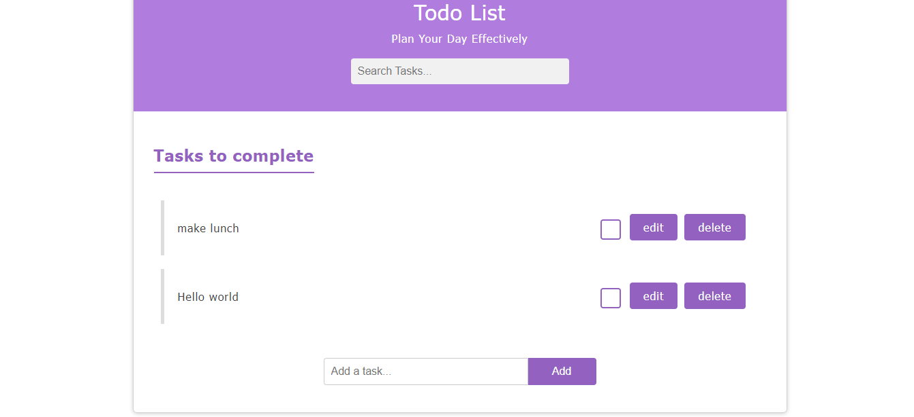
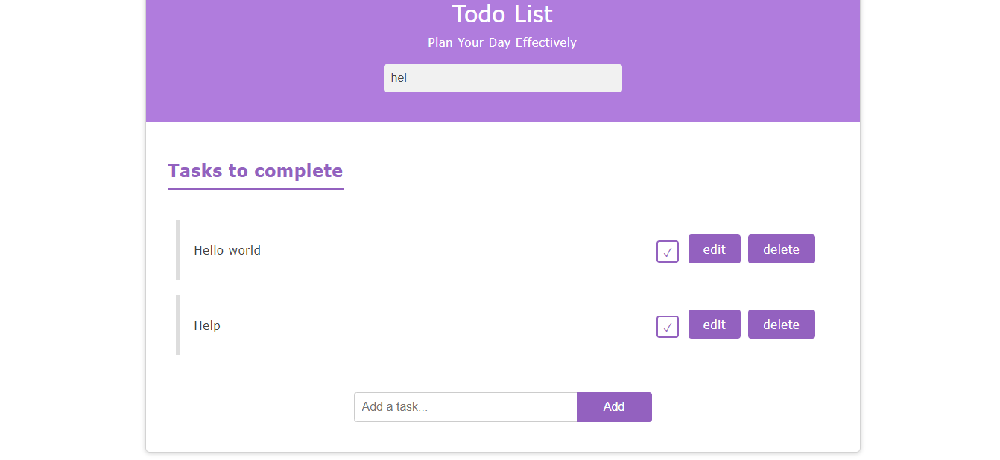
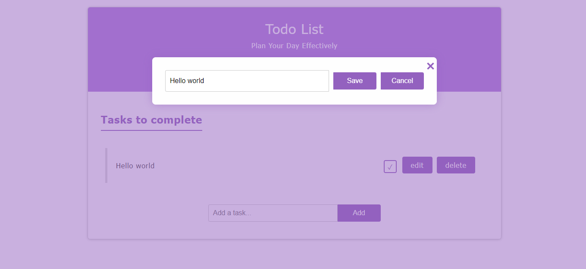
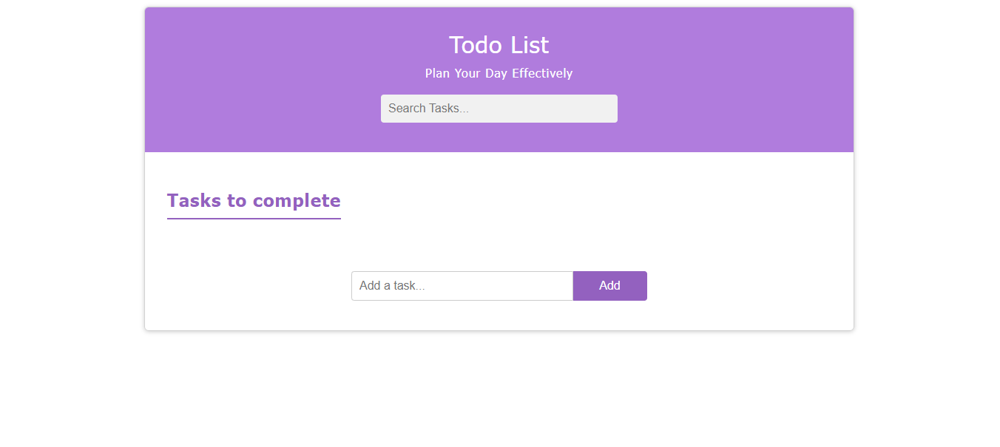

# Todo List

A simple Todo List application built using Vanilla JavaScript.

## Table of Contents

- [Description](#description)
- [Features](#features)
- [Installation](#installation)
- [Usage](#usage)
- [Screenshots](#screenshots)
- [Contributing](#contributing)

## Description

This Todo List application allows users to create, manage, and track their tasks. It is built using Vanilla JavaScript, without any external libraries or frameworks.

## Features

- Add new tasks
- Mark tasks as complete
- Edit existing tasks
- Delete tasks
- Search through tasks

## Installation

1. Clone the repository: https://github.com/rebumatadele/Todo-list.git
2. Navigate to the project directory: cd Todo-list
3. Open the `index.html` file in your web browser.

## Usage

1. Enter a new task in the input field and press the "Add" button.
2. To mark a task as complete, click the checkbox next to the task.
3. To edit a task, double-click the task text and enter the new text, then press Enter.
4. To delete a task, click the trash can icon next to the task.

## Screenshots

## Contributing

Contributions are welcome! If you find any issues or have suggestions for improvements, please feel free to open an issue or submit a pull request.

# Todo List Application

This project is a simple and elegant Todo List application that helps users plan and manage their daily activities. It allows users to add, edit, complete, and delete tasks. The application keeps track of the number of pending and completed tasks, providing a clear overview of the user's progress.

## Features

- Add new tasks with details and start date.
- Edit existing tasks.
- Mark tasks as complete, applying a strike-through effect.
- Delete tasks.
- Keeps track of completed and pending tasks.

## Screenshots

### Initial Page

Below is a screenshot of the initial page of the Todo List application, where no tasks have been added yet:

- **Header**: Welcomes the user with a motivational message.
- **Form**: Allows the user to input the task title, details, and start date.
- **Add Task Button**: Adds the task to the list.
- **Task List**: Displays a message prompting the user to add tasks.
- **Task Info**: Shows the count of completed and pending tasks, which are initially zero.
- **Footer**: Contains the author's name and social media icons.

### Adding a Task

Below is a screenshot showing the user entering a task title, details, and start date:

- **Form**: User enters the task title, details, and start date.
- **Add Task Button**: Clicking on this button will add the task to the Todo List.

## Task Marked as Complete

Below is a screenshot showing a task that has been marked as complete:

- **Task List**: Shows a task that has been marked as complete. The title, details, and start date of the completed task are struck through.
- **Task Actions**: Each task has a checkbox to mark it as complete, an edit button to modify the task, and a delete button to remove the task.
- **Task Info**: Updates the count of completed and pending tasks accordingly.

## Editing a Task

Below is a screenshot showing the user editing an existing task:

- **Form**: The selected task's title, details, and start date are populated in the input fields for editing.
- **Edit Task Button**: Clicking on this button will save the changes made to the task.

## Deleting a Task

Below is a screenshot showing the state of the application after a task has been deleted:

